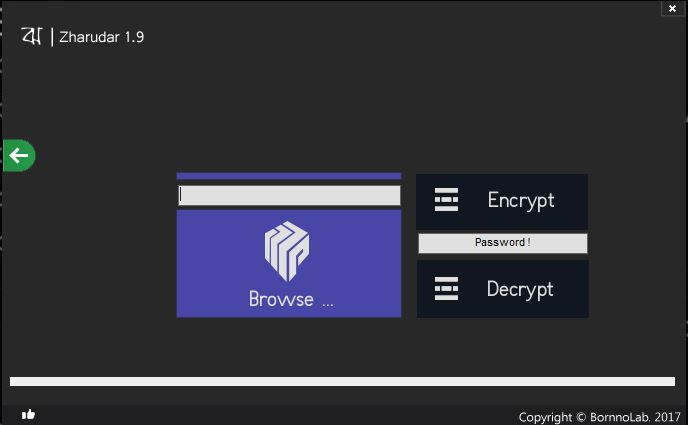

# Zharudar 1.9
it is a software containing the facilities: system optimization, temporary file cleaning and exclusive utility tools. It's easy to use. And it's the first software in Bangladesh which enables the services mentioned above. It's popularity is growing very rapidly in Bangladesh. It's the 9th version of Zharudar software that I'm talking about. I hope people all over the world will enjoy using this software.

Information:
------------
- Programming Language: VB
- Compiler: VB6

Features:
-----------------------
- Clean Junk Files
- Ram & PC Booster
- Strong File Crypter
- Auto Shutdown
- Autorun Remover
- Uninstaller
- All Necessary System Tools 
- User Friendly UI & Updates

Screenshot
---------------

          

          

          
  
          

          
Dowload
------------
https://sourceforge.net/projects/zharudar/files/Setup_Zharudar1.9.exe/download

Website
---------
https://bornno-lab.blogspot.com/
